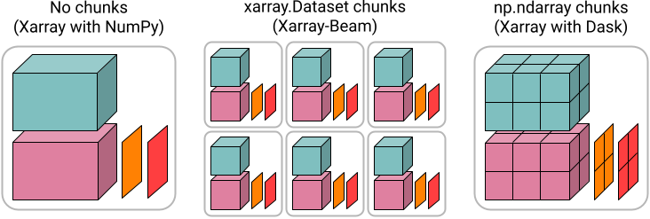

# Xarray-Beam

Xarray-Beam is a Python library for building
[Apache Beam](https://beam.apache.org/) pipelines with
[Xarray](http://xarray.pydata.org/en/stable/) datasets.

The project aims to facilitate data transformations and analysis on large-scale
multi-dimensional labeled arrays, such as:

- Ad-hoc computation on Xarray data, by dividing a `xarray.Dataset` into many
  smaller pieces ("chunks").
- Adjusting array chunks, using the
  [Rechunker algorithm](https://rechunker.readthedocs.io/en/latest/algorithm.html)
- Ingesting large multi-dimensional array datasets into an analysis-ready,
  cloud-optimized format, namely [Zarr](https://zarr.readthedocs.io/) (see also
  [Pangeo Forge](https://github.com/pangeo-forge/pangeo-forge-recipes))
- Calculating statistics across distributed dimensions and with arbitrary
  groupings (not yet implemented)

Xarray-Beam is implemented as a _thin layer_ on top of existing libraries for
working with large-scale Xarray datasets. For example, it leverages
[Dask](https://dask.org/) for describing lazy arrays and for executing
multi-threaded computation on a single machine.

## How does Xarray-Beam compare to Dask?

We love Dask! Xarray-Beam explores a different part of the design space for
distributed data pipelines than Xarray's built-in Dask integration:

- Xarray-Beam is built around explicit manipulation of
  `(ChunkKey, xarray.Dataset)` pairs to perform operations on distributed
  datasets, where `ChunkKey` is an immutable dict keeping track of the offsets
  from the origin for a small contiguous "chunk" of a larger distributed
  dataset. This requires more boilerplate but is also more robust than
  generating distributed computation graphs in Dask using Xarray's built-in API.
  The user is expected to have a mental model for how their data pipeline is
  distributed across many machines.
- Xarray-Beam distributes datasets by splitting them into many `xarray.Dataset`
  chunks, rather than the chunks of NumPy arrays typically used by Xarray with
  Dask (unless using
  [xarray.map_blocks](http://xarray.pydata.org/en/stable/user-guide/dask.html#automatic-parallelization-with-apply-ufunc-and-map-blocks)).
  Chunks of datasets is a more convenient data-model for writing ad-hoc
  whole dataset transformations, but is potentially a bit less efficient.
- Beam ([like Spark](https://docs.dask.org/en/latest/spark.html)) was designed
  around a higher-level model for distributed computation than Dask (although
  Dask has been making
  [progress in this direction](https://coiled.io/blog/dask-under-the-hood-scheduler-refactor/)).
  Roughly speaking, this trade-off favors scalability over flexibility.
- Beam allows for executing distributed computation using multiple runners,
  notably including Google Cloud Dataflow and Apache Spark. These runners are
  more mature than Dask, and in many cases are supported as a service by major
  commercial cloud providers.

These design choices are not set in stone. In particular, in the future we
_could_ imagine writing a high-level `xarray_beam.Dataset` that emulates the
`xarray.Dataset` API, similar to the popular high-level DataFrame APIs in Beam,
Spark and Dask. This could be built on top of the lower-level transformations
currently in Xarray-Beam, or alternatively could use a "chunks of NumPy arrays"
representation similar to that used by dask.array.

## Getting started

Xarray-Beam requires recent versions of xarray, apache_beam, dask, rechunker and
zarr.

TODO(shoyer): write a tutorial here! For now, see the test suite for examples.

## Disclaimer

Xarray-Beam is an experiment that we are sharing with the outside world in the
hope that it will be useful. It is not a supported Google product. We welcome
feedback, bug reports and code contributions, but cannot guarantee they will be
addressed.

See the "Contribution guidelines" for more.

## Credits

Contributors:

- Stephan Hoyer
- Jason Hickey
- Cenk Gazen
